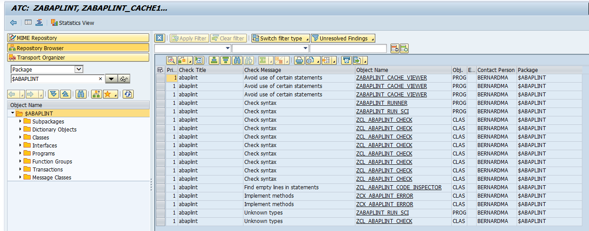
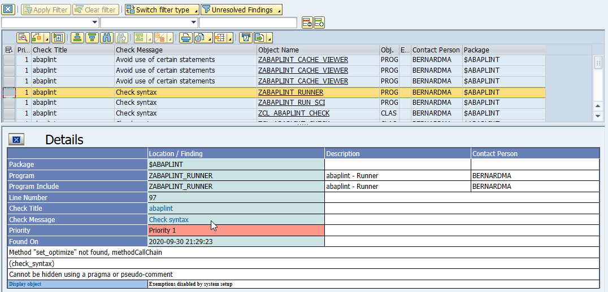
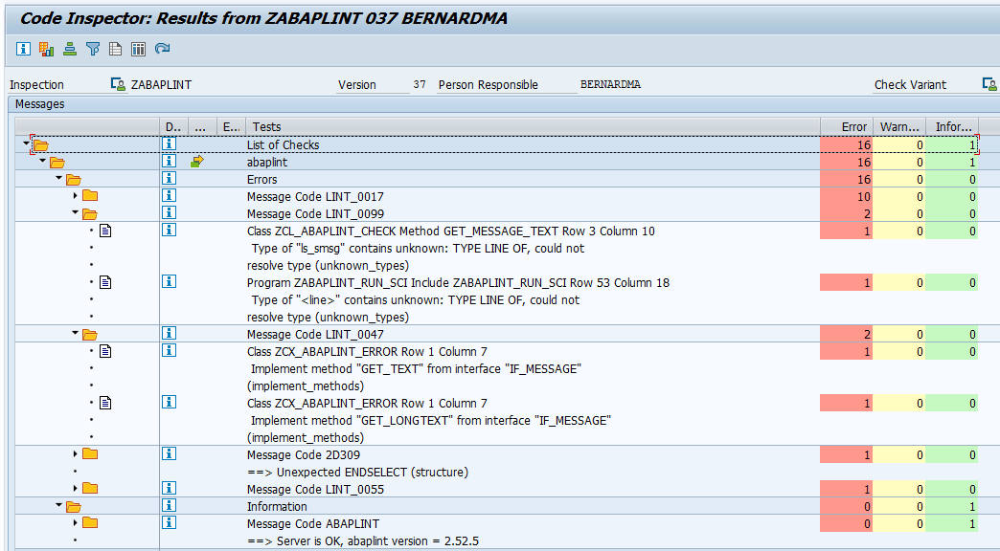
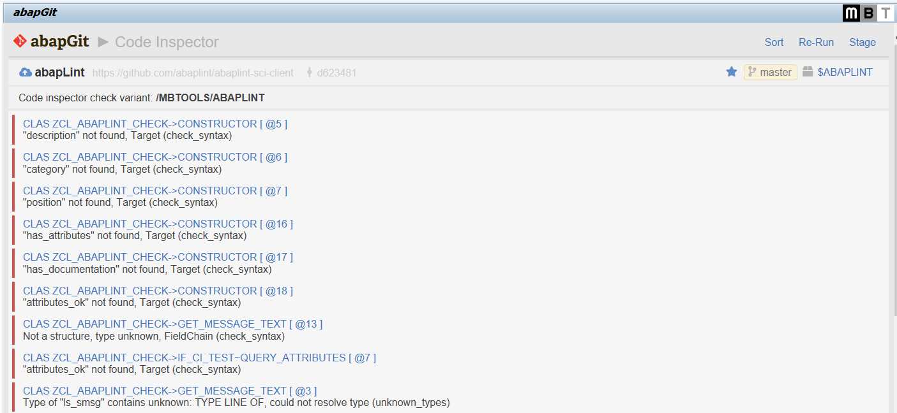

# abaplint SCI client

This project enables [abaplint](https://abaplint.org) to be run in the context of SAP Code Inspector (SCI), allowing immediate feedback to the ABAP developers in their standard editor, SE24 / SE80 / SE38 / ABAP in Eclipse. And also works seamlessly with other places where the code inspector is triggered like ABAP Test Cockpit (ATC).
 
## Overview

The integration requires two parts: The [abaplint Server](https://github.com/abaplint/abaplint-sci-server) and the abaplint Client (this project). When performing code checks through one of the supported editors or transactions, the abaplint Client will collect the necessary objects and dependencies and send them to the abaplint Server to be processed. The server responds with all of the abaplint findings, which are displayed like any other check results in the SAP tools.

**Important:** The code under test leaves your ABAP system! Be sure to use a secure and controllable abaplint Server. For a test, you might use the common server at [https://sci.abaplint.app](https://sci.abaplint.app) (but please don't post any proprietary code).

**Note:** Dependencies maintained in `abaplint.json` (in your repository) are ignored when running via SCI. Instead the dependencies are taken from the running ABAP system.

## Examples

1. ATC

Clicking the 'Check' or 'Check message' links will display the documentation of the rule in a browser. Click on the object name in the overview or 'Display object' in the details to jump to the location in the code related to the finding.

2. SCI

Clicking the 'Info' icon next to a message will display the documentation of the rule in a browser. Double-click on a message to jump to the location in the code related to the finding.

3. abapGit

Click on the object name to jump to the location in the code related to the finding.

## Documentation

* [Installation](docs/installation.md)
* [Tools](docs/tools.md)
* [Exporting Dependencies](docs/export_dependencies.md)

## Blog Posts

- https://blogs.sap.com/2020/02/01/running-abaplint-from-sci-atc-adt/
