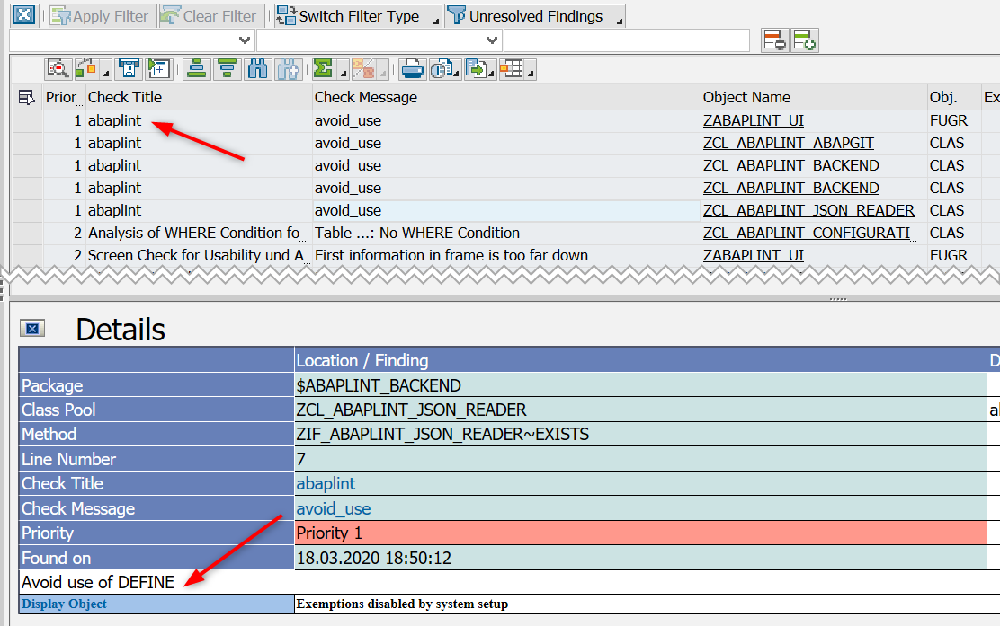
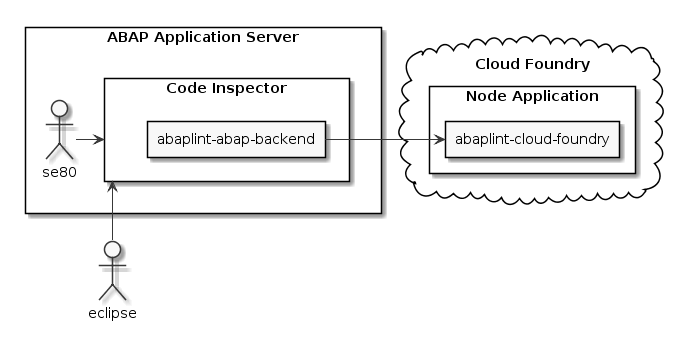
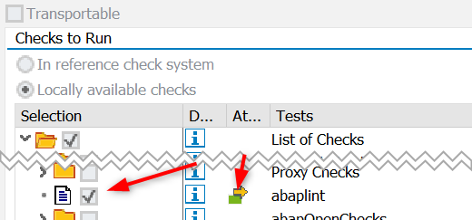

# abaplint abap backend

## Purpose

This is a toolset to run abaplint checks within an SCI run.

It consist of 2 parts: (1) the abap backend (this repo), which integrates with SCI and posts the code to the server part (2) which runs the abaplint (with nodejs).

**Important:** the code under test leaves your abap instance! Be sure to use secure and controllable abaplint server. For a test you might use common one: [http://sci.abaplint.org/](http://sci.abaplint.org/) (but please don't post any proprietary code).

Dependencies from `abaplint.json` are ignored when running via SCI, instead the dependencies are taken from the running ABAP system.

## Installation

* Prerequisites: 
    * abapGit dev version must be installed (with all the separate classes, not a simple file version)
    * ABAP731 required, potentially works with 702. Though downported json xml parser should be available.
* Install on ABAP backend (this repo) using abapGit
* Activate check in SCI -> Management of -> Tests
* Adjust check variants, maintain connection to [abaplint-cloud-foundry](https://github.com/abaplint/abaplint-cloud-foundry)
* abaplint settings are defined per target package

## ZABAPLINT_DEPENDENCIES
Serialize dependencies of a package structure to git.

**Warning:** Do not specify the git repository of the package as the target!

For use in connection with static code analysis, method implementations of dependencies are excluded in the files.

#### Example
* ABAP development is done in package $PROJECT, and stored in repository https://github.com/user/project/
* Create a new repository project_deps to store the dependencies
* Run report with input $PROJECT and repository https://github.com/user/project_deps/, note that files in project_deps will be overwritten without any warnings

## Posts

- https://blogs.sap.com/2020/02/01/running-abaplint-from-sci-atc-adt/
