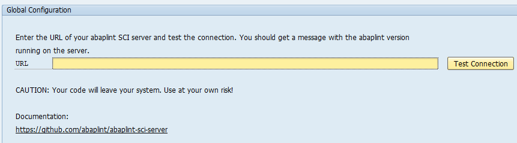

# Installation

## Prerequisites

* ABAP Application Server 7.31 or higher 
(Potentially works with 702 though downported json xml parser should be available)
* [abaplint Server](https://github.com/abaplint/abaplint-sci-server) 

## Dependencies

The following repositories must be installed in this order:

* [abapGit developer version](https://docs.abapgit.org/guide-install.html#install-developer-version) 
(with all the separate classes, not a simple file version)
* [ajson](https://github.com/sbcgua/ajson) 
* [abaplint Client](https://github.com/abaplint/abaplint-sci-client) (this repo)

## Initial Setup

1. Test Management

Activate the abaplint check in transaction `SCI` -> Management of -> Tests

2. Check Variant

In transaction `SCI`, create a new test variant. Note: If you want to use the variant within abapGit, it has to be a global variant (icon with two users).

Select the abaplint check and use the arrow icon to jump to the abaplint configuration.

abaplint needs general configuration and settings that are defined per SAP package

3. General Configuration

Select 'Configuration' and maintain the connection to your [abaplint Server](https://github.com/abaplint/abaplint-sci-server). 

If you do not have your own abaplint Server, you might want to use http://sci.abaplint.org which is currently provided for free. **Caution:** Use 
this server at your own risk. Your code will leave your system over a connection that is *not* encrypted!

Optional parameters:
- Dependency depth - Defines over how many levels the check will try to resolve dependencies of ABAP classes (via inheritance, interfaces, attributes, or types)
- Continue into SAP objects - Decides if dependencies of SAP objects should be included in the check 
- Use disk cache - Select if dependencies and serialized files shall be cache in transparent tables **WIP**

4. Package Configuration

You have to maintain the abaplint configuration for SAP package level. The configuration for a given package will also cover all subpackages and their objects.
Select 'Add package', add the configuration, and save it.

You can retrieve either the default configuration which includes all rules supported by your abaplint server using 'Update with Default'. If your package is
linked to an abapGit repository, then you can use 'Update from abapGit' to get the content of the abaplint.json file as a basis for your configuration.

**Note:** General as well as package configurations will be valid for all check variants that enable the abaplint checks. They are not check variant-specific.

Remember to save all changes to configuration and check variant.
