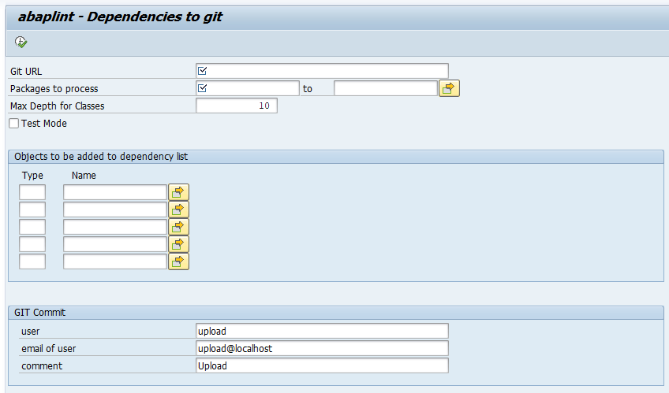
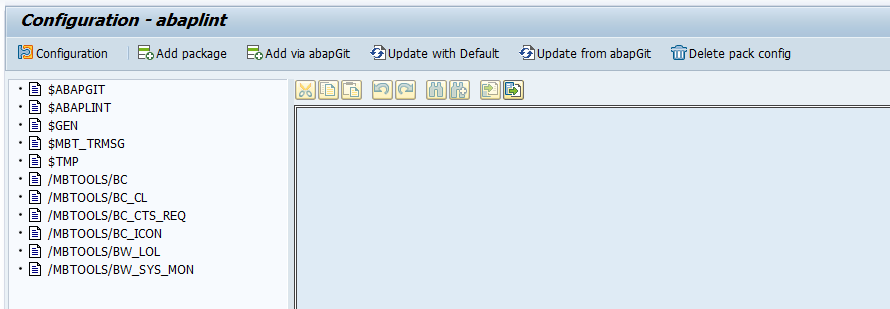
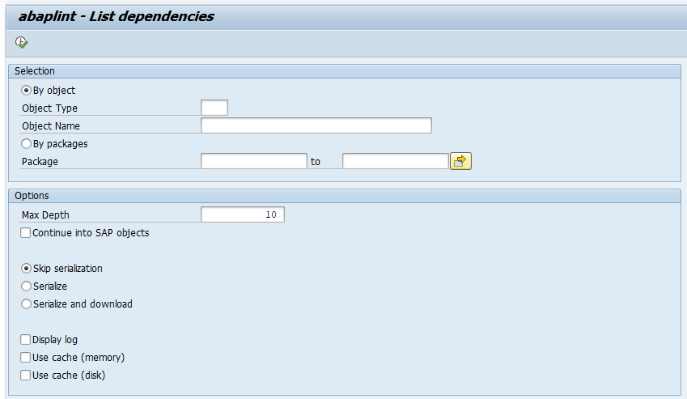
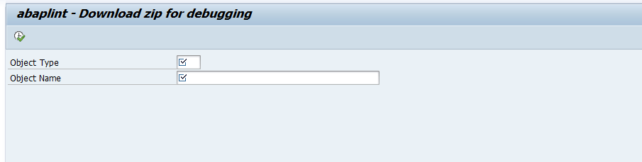
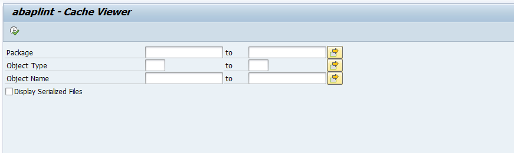

# Tools for abaplint

## ZABAPLINT_DEPENDENCIES

Serialize dependencies of a package structure to git. See [here](export_dependencies.md) for details.

## ZABAPLINT_LIST_DEPS

Test and display a list of dependent objects either per object or for a complete package.

## ZABAPLINT_CONFIG

Jump to the configuration screens of the abaplint check.

## ZABAPLINT_DEBUG

Download a zip of the serialized files for a given object.

## ZABAPLINT_CACHE_VIEWER

Display the contents of the cache for dependencies and serialized files.

